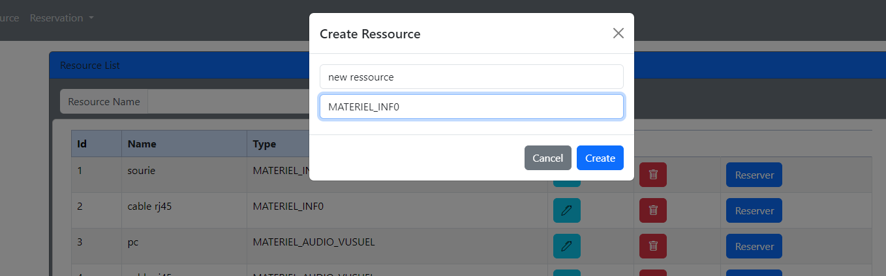
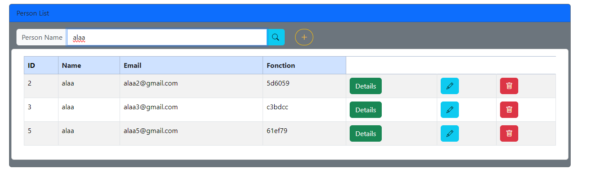

# Resource Reservation Application

Introduction
Nous souhaitons créer une application basée sur une architecture de micro-services qui permet de gérer des réservations concernant des ressources. Chaque réservation concerne une seule ressource. Le système se compose de trois micro-services techniques à mettre en place :

Le service de passerelle basé sur Spring Cloud Gateway
Le service de découverte basé sur Eureka Server Discovery
Le service de configuration basé sur Spring Cloud Config
Et deux autres micro-services :

Service Ressource : qui permet de gérer les ressources. Une ressource est définie par son id, son nom et son type (MATERIEL_INFO, MATERIEL_AUDIO_VISUEL).
Service Réservation : qui permet de gérer les réservations effectuées par des personnes. Une réservation est définie par son id, son nom, son contexte, sa date et sa durée. Chaque réservation est effectuée par une personne. Une personne est définie par son id, son nom, son email et sa fonction.

## Outils


```
- Spring Cloud
- Eureka Discovery
- H2DataBase
- Keycloak
- Docker
```

## Project Architecture 
<table align="center">
  <tr></tr>
</table>
<br>

## Project Structure 
```
Ressource-Reservation-App

  |__ angular-app
        |__ src
            |__ assets
            |__ app
                |__ guard
                |__ models
                |__ pages
                    |__ personne-detail
                    |__ personne
                    |__ reservation-detail
                    |__ reservation
                    |__ ressource
                |__ services

  |__ config-git-repo
        |__ applications properties files

  |__ config-service
        |__ src
            |__ main
                |__ java/com/exemple/configservice
                |__ resources

  |__ discovery-service
        |__ src
            |__ main
                |__ java/com/exemple/discoveryservice
                |__ resources

  |__ gateway-service
        |__ src
            |__ main
                |__ java/com/exemple/gatewayservice
                |__ resources

  |__ reservation-service
        |__ src
            |__ main
                |__ java/com/exemple/reservationservice
                    |__ dto
                    |__ entities
                    |__ enums
                    |__ mappers
                    |__ repository
                    |__ ressource
                    |__ security
                    |__ service
                    |__ web
                |__ resources

  |__ ressource-service
        |__ src
            |__ main
                |__ java/com/exemple/ressourceservice
                    |__ dto
                    |__ entities
                    |__ enums
                    |__ mappers
                    |__ repository
                    |__ security
                    |__ service
                    |__ web
                |__ resources
```
<br>

## Eureka Service 
<table align="center">
 
  <tr>
    <td></td>
   
  </tr>
</table>
<br>

## Config & Gateway Service

<h3>Config Actuator</h3>
    

<h3>Gateway Actuator</h3>

<br>

## Ressource Service API Doc
<table align="center">
  <tr>
    <th>Rest API</th>
    <th>Get Reservation</th>
   </tr>
  <tr>
    <td></td>
    <td></td>
  </tr>
    <th>Get ressource</th>
    <th>Get Id</th>
  <tr>
    <td></td>
    <td></td>
  </tr>
   </tr>
    <th>Update</th>
    <th>Delete</th>
  <tr>
    <td></td>
    <td></td>
  </tr>
</table>
<br>


<br>

## OpenFeign & Circuit Breaker
- OpenFeign est un client déclaratif de services web qui simplifie l'intégration de services web REST dans les applications en permettant de définir des services sous forme d'interfaces, les traduisant automatiquement en requêtes HTTP.
- Le motif du disjoncteur (circuit breaker) est une approche de conception dans les systèmes distribués visant à empêcher qu'une défaillance d'un seul service ne provoque la défaillance de l'ensemble du système. Il gère les erreurs et la latence, assurant une tolérance aux pannes et une résilience dans un environnement distribué.
```java
@FeignClient(name = "RESSOURCE-SERVICE",configuration = OpenFiegnConfiguration.class)
public interface RessourceOpenFeign {

    @GetMapping("/ressources/{id}")
    @CircuitBreaker(name = "ressourceService", fallbackMethod = "getDefaultRessource")
    Ressource getRessourceById(@PathVariable("id") int id);

    @GetMapping("/ressources")
    @CircuitBreaker(name = "ressourceService", fallbackMethod = "getAllDefaultRessources")
    List<Ressource> getAllRessources();

    default Ressource getDefaultRessource(int id, Exception exception){
        Ressource ressource=new Ressource();
        ressource.setId(id);
        ressource.setNom("Not Vailable");
        ressource.setType(null);
        return ressource;
    }
    default List<Ressource> getAllDefaultRessources(Exception exception){
        return List.of();
    }
}
```
<br>

## Angular Frontend
<table align="center">
  <tr>
    <th>Authentication</th>
    <th>Home</th>
   </tr>
  <tr>
    <td></td>
    <td></td>
  </tr>
  <tr>
    <th>Ressource Table</th>
    <th>ADD Ressource</th>
  </tr>  
  <tr>
    <td></td>
    <td></td>
  </tr>
  <tr>
    <th>Add RESERVATION</th>
    <th>RESERVATION</th>
  </tr>
  <tr>
    <td></td>
    <td></td>
  </tr>
  <tr>
    <th>Update</th>
    <th>Overview</th>
  </tr>
  <tr>
    <td></td>
    <td></td>
  </tr>
  
</table>
<br><br>
<table align="center">
  <tr>
    <th>Personne Table</th>
    <th>Search</th>
  </tr>  
  <tr>
    <td></td>
    <td></td>
  </tr>
  <tr>
    <th>Add</th>
    <th>Overview</th>
  </tr>
  <tr>
    <td></td>
    <td></td>
  </tr>
  <tr>
    <th>Update</th>
    <th>Overview</th>
  </tr>
  <tr>
    <td></td>
    <td></td>
  </tr>
 
</table>
<br>

## Sécurité de l'Application avec OAuth

### 1. OAuth
OAuth est un cadre d'autorisation qui permet à une application tierce d'obtenir un accès limité à un service HTTP au nom du propriétaire de la ressource, tel qu'un utilisateur. Ce n'est pas un protocole d'authentification, mais il se concentre sur l'accès délégué et l'autorisation, et prend en charge divers types de subventions, tels que le code d'autorisation, implicite, mot de passe du propriétaire de la ressource et client.<table align="center">
  <tr>
    <th>Fonctionnement</th>
   </tr>
  <tr>
    <td></td>
  </tr>
</table>
<br>


### 3. Keycloak
Keycloak est une solution open source de gestion de l'identité et de l'accès. Il offre des fonctionnalités d'authentification, d'autorisation et de gestion des utilisateurs, et prend en charge diverses normes, dont OAuth et OIDC. Keycloak peut être configuré en tant que serveur d'autorisation OAuth et fournisseur OIDC. Les clients dans Keycloak sont enregistrés avec les paramètres nécessaires et peuvent utiliser les flux OAuth ou OIDC pour l'authentification et l'autorisation. Rôle de Keycloak :
Authentification : Keycloak gère le processus d'authentification, y compris le support de divers fournisseurs d'identité.
Autorisation : Keycloak sert de serveur d'autorisation, gérant les jetons d'accès et appliquant les politiques d'autorisation.
Gestion des utilisateurs : Keycloak permet aux administrateurs de gérer les utilisateurs, les rôles et les autorisations.
Single Sign-On (SSO) : Keycloak prend en charge le SSO, permettant aux utilisateurs de se connecter une fois et d'accéder à plusieurs applications sans se réauthentifier.
<table align="center">
  <tr>
    <th>Fonctionnement</th>
   </tr>
  <tr>
    <td></td>
  </tr>
</table>
<br>

### 4. Steps

<h3>Authentication</h3>
 

 
  
<h3>Create Client</h3>
  
  

  
  
<h3>Create Users</h3>
 
  

<h3>Create Roles</h3>


- Sécurisation de l'application frontend : Stockez de manière sécurisée les jetons dans l'application cliente. Incluez le JWT dans l'en-tête Authorization lors de l'envoi de requêtes vers des ressources protégées.
- Configuration de l'interface Rest OpenFeign afin qu'elle puisse accéder au service de ressources.
```java
@Component
public class OpenFiegnConfiguration implements RequestInterceptor {
    @Override
    public void apply(RequestTemplate requestTemplate) {
        SecurityContext context = SecurityContextHolder.getContext();
        JwtAuthenticationToken authentication = (JwtAuthenticationToken) context.getAuthentication();
        String tokenValue = authentication.getToken().getTokenValue();
        requestTemplate.header("Authorization","Bearer "+tokenValue);
    }
}
```
</br>

## Docker Deployment
```java
services:
  postgres-service:
    image: postgres
    container_name: postgres-service
    volumes:
      - postgres_data:/var/lib/postgresql/data
    environment:
      POSTGRES_DB: keycloak
      POSTGRES_USER: keycloak
      POSTGRES_PASSWORD: ****
    ports:
      - '5432:5432'
    expose:
      - '5432'
    healthcheck:
      test: "exit 0"
  pgadmin4:
    image: dpage/pgadmin4
    container_name: pgadmin4
    restart: always
    ports:
      - "8083:80"
    environment:
      PGADMIN_DEFAULT_EMAIL: alaa@gmail.com
      PGADMIN_DEFAULT_PASSWORD: ****
    volumes:
      - pgadmin_data:/var/lib/pgadmin
  keycloak:
    image: quay.io/keycloak/keycloak:latest
    environment:
      KC_DB: postgres
      KC_DB_URL: jdbc:postgresql://postgres-service:5432/keycloak
      KC_DB_USERNAME: keycloak
      KC_DB_PASSWORD: ****
      KEYCLOAK_ADMIN: admin
      KC_HTTP_ENABLED: "true"
      KC_HOSTNAME_STRICT_HTTPS: "false"
      KEYCLOAK_ADMIN_PASSWORD: ****
    command:
      - start-dev
    restart: always
    ports:
      - '8080:8080'
    expose:
      - '8080'
    depends_on:
      - postgres-service
  discovery-service:
    build: ./discovery-service
    container_name: discovery-service
    ports:
      - '8761:8761'
    expose:
      - '8761'
    healthcheck:
      test: [ "CMD", "curl", "-f", "http://localhost:8761/actuator/health" ]
      interval: 10s
      retries: 4
  config-service:
    build: ./config-service
    container_name: config-service
    ports:
      - '9999:9999'
    expose:
      - '9999'
    environment:
      - DISCOVERY_SERVICE_URL=http://discovery-service:8761/eureka
    healthcheck:
      test: [ "CMD", "curl", "-f", "http://localhost:9999/actuator/health" ]
      interval: 10s
      retries: 4
    depends_on:
      discovery-service:
        condition: service_healthy
  gateway-service:
    build: ./gateway-service
    container_name: gateway-service
    ports:
      - '8888:8888'
    expose:
      - '8888'
    environment:
      - DISCOVERY_SERVICE_URL=http://discovery-service:8761/eureka
      - CONFIG_SERVICE_URL=http://config-service:9999
    depends_on:
      config-service:
        condition: service_healthy
  ressource-service:
    build: ./ressource-service
    container_name: ressource-service
    ports:
      - '8081:8081'
    expose:
      - '8081'
    environment:
      - DISCOVERY_SERVICE_URL=http://discovery-service:8761/eureka
      - CONFIG_SERVICE_URL=http://config-service:9999
      - JWT_ISSUER_URI:http://keycloak:8080/realms/sdia-realm
      - JWT_JWK_SET_URI:http://keycloak:8080/realms/sdia-realm/protocol/openid-connect/certs
    healthcheck:
      test: [ "CMD", "curl", "-f", "http://localhost:8081/actuator/health" ]
      interval: 10s
      retries: 4
    depends_on:
      config-service:
        condition: service_healthy
  reservation-service:
    build: ./reservation-service
    container_name: reservation-service
    ports:
      - '8082:8082'
    expose:
      - '8082'
    environment:
      - DISCOVERY_SERVICE_URL=http://discovery-service:8761/eureka
      - CONFIG_SERVICE_URL=http://config-service:9999
      - JWT_ISSUER_URI:http://keycloak:8080/realms/sdia-realm
      - JWT_JWK_SET_URI:http://keycloak:8080/realms/sdia-realm/protocol/openid-connect/certs
    depends_on:
      ressource-service:
        condition: service_healthy
  angular-app:
    build: ./angular-app
    container_name: angular-app
    ports:
      - '8085:80'
    expose:
      - '8085'
    restart: always
    depends_on:
      - keycloak
      - ressource-service
      - reservation-service
volumes:
  postgres_data:
  pgadmin_data:
```


